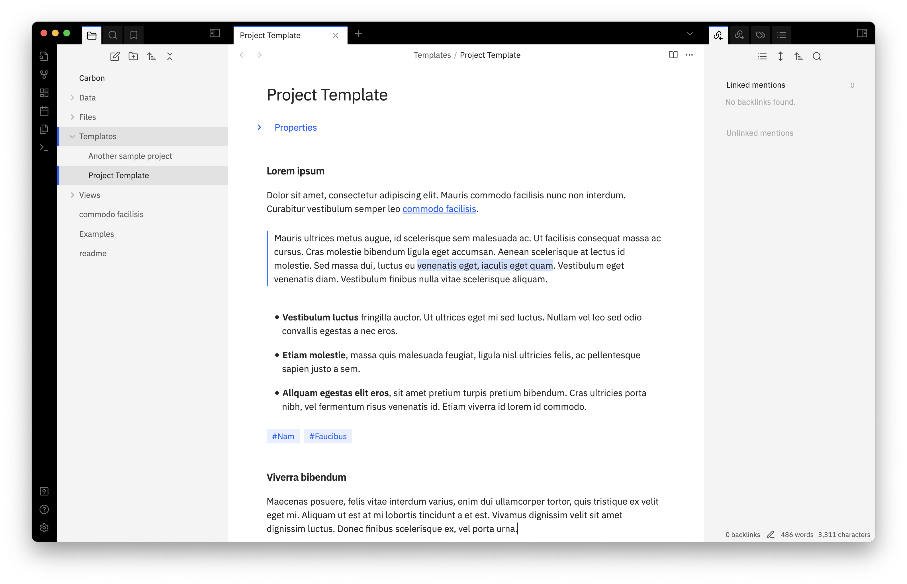
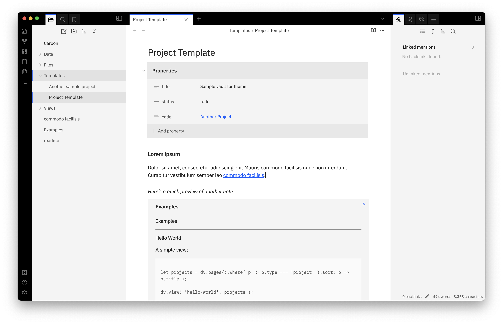
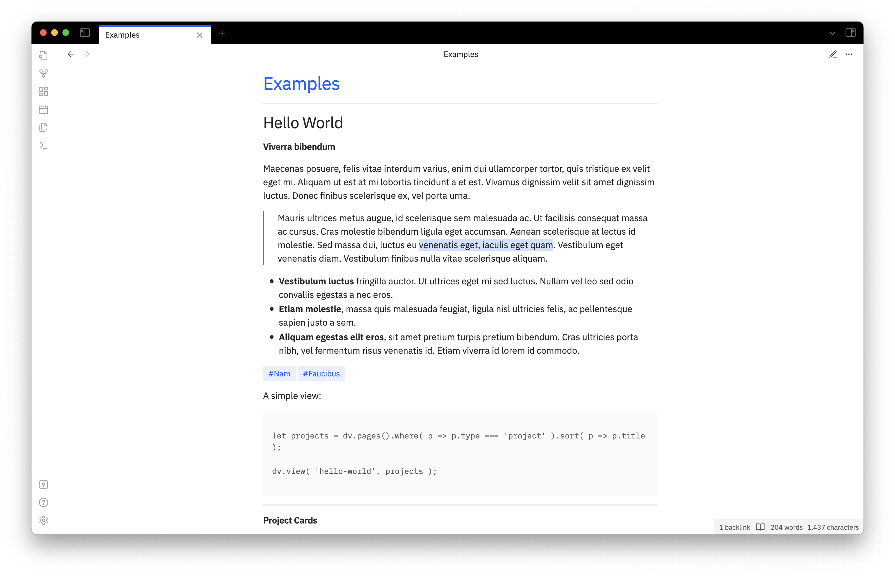

A minimal and opinionated theme with light and dark schemes for Obsidian. This theme is based largely, but not entirely, on the [IBM Carbon design specifications](https://carbondesignsystem.com) from which it gets its name.

**NB** This theme is in beta. Please open an issue on Github if you have problems, or send an e-mail to hello@vhbelvadi.com or @vhbelvadi@historians.social on Mastodon.

---

### Tips

1. Please turn off `Settings → Appearance → Translucent window` while using this theme.
2. In the screenshots, `Settings → Appearance → Interface → Show inline title` has been turned off.
3. The recommended accent colour is `#0F62FE` – specify this in `Settings → Appearance → Accent color`.
4. If you plan to clone this repo into your `/.obsidian/themes` folder, please rename it to `Carbon` for it to show up inside Obsidian.
5. For best results, quit and reopen Obsidian after applying as well as updating this theme.

---

### Screenshots

_Editing mode (light scheme)_

_Menu (dark scheme)_

_Example showing embed previews (light scheme)_

_Reading mode (light scheme)_
