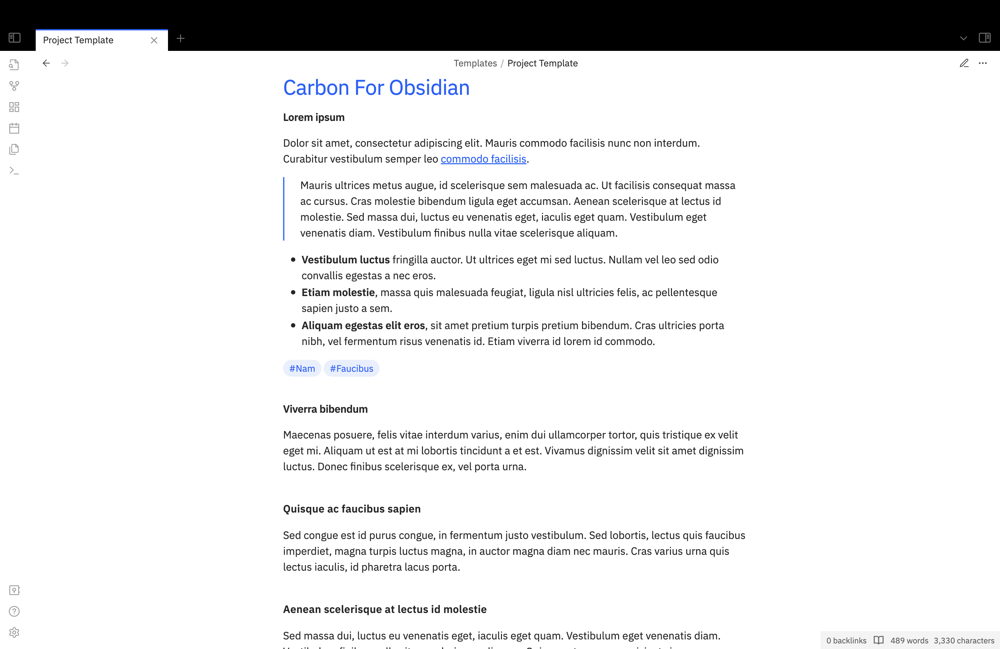

A minimal and opinionated theme with light and dark schemes for Obsidian. This theme is based largely, but not entirely, on the IBM Carbon design specifications from which it gets its name.

**NB** This theme is in beta. Please open an issue on Github if you have problems, or send an e-mail to hello@vhbelvadi.com or @vhbelvadi@historians.social on Mastodon.

**Editing mode**

**Reading mode**

